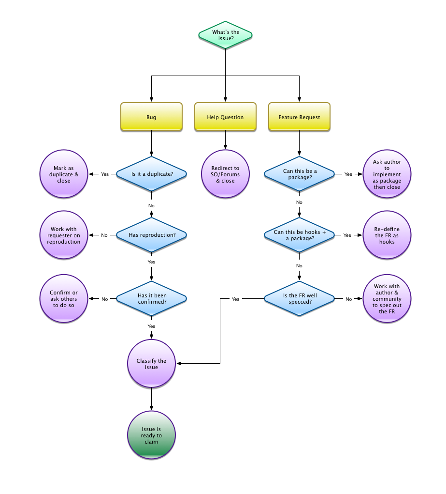

# Issue Triage

This document describes the process Meteor contributors use to organize issues. We use Github [issues](https://github.com/meteor/meteor/issues) to track bugs and feature requests. Our goal is to maintain a list of issues that are relevant and well-defined (and [labeled](https://github.com/meteor/meteor/labels)) such that a contributor can immediately begin working on the code for a fix or feature request. Contributors who want to dive in and write code aren't likely to prioritize working on issues that are ambiguous and have low impact.

We would love to have more contributors who are willing to help out with triaging issues. You can begin by helping issue requesters create good reproductions and by confirming those reproductions on your own machine. It won't be long before the core maintainers notice your work and ask whether you'd like to be promoted to an issue maintainer.

- [Issue lifecycle](#issue-lifecycle)
  - [Bugs](#bugs)
  - [Help questions](#help-questions)
  - [Feature requests](#feature-requests)
- [Classification](#classification)
  - [Severity](#severity)
  - [Impact](#impact)
- [Issues ready to claim](#issues-ready-to-claim)

## Issue lifecycle

All issues follow the flow outlined below. Your job as an issue maintainer is to work with the requester and others within the community towards the goal of having an issue either become 'claimable' or closed. Read on for more details on the process.

The first step is in determining whether the issue is a bug, help question or feature request. Read on for more details.

### Bugs

1. Duplicates should be closed and marked as such.
2. Add the `bug` label and `Project:*` labels that apply (a best guess on the `Project:` is fine; sometimes it's hard to tell exactly which project the issue falls under).
3. Bugs should have a high-quality reproduction as described [here](Contributing.md#reporting-bug). You may need to help the reporter reduce their bug to a minimal reproduction.
4. A reproduction should be confirmed by at least one person other than the original reporter. Run the reproduction and validate that the bug exists; then make a note of your findings on the issue. If a reproduction is supplied but doesn't work, add the `can't-reproduce` label and make a comment describing what happened.
5. Finally, once you've confirmed the reproduction add the `confirmed` label and [classify](#classification) the issue (removing the `can't-reproduce` label if it exists).

### Help questions

[Stack Overflow](http://stackoverflow.com/questions/tagged/meteor) and our [forums](https://forums.meteor.com/c/help) are the place to ask for help on using the framework. Close issues that are help requests and politely refer the author to the above locations.

### Feature requests

1. For reasons described [here](Contributing.md#feature-requests), we would prefer features to be built as separate packages. If the feature can clearly be built as a package, explain this to the requester and close the issue.
> - If the feature could be built as a package and serves a particular need, encourage the user to contribute it themselves.
>- If the underlying issue could be better solved by existing technology, encourage them to seek help in the [forums](https://forums.meteor.com/c/help) or on [Stack Overflow](http://stackoverflow.com/questions/tagged/meteor).
2. If you haven't closed the issue, add the `feature` label and `Project:*` labels that apply (a best guess on the `Project:` is fine, sometimes it's hard to tell exactly which project the issue falls under).
3. If it's not possible to build the feature as a package (as you identified in step 1), explore whether creating hooks in core would make it possible to do so. If it would, redefine the issue as a request to create those hooks.
4. Work with the requester and others in the community to build a clear specification for the feature and update the issue description accordingly.
5. Finally, add the `confirmed` label and [classify](#classification) the issue.

Core contributors may add the `pull-requests-encouraged` label to feature requests. This indicates the feature is aligned with the project roadmap and a high-quality pull request will almost certainly be merged.

<h2 id="classification">Classification</h2>

Assign a classification (via GH labels) that enables the community to determine how to prioritize which issues to work on. The classification is based on *Severity x Impact* .

### Severity
_[Severity:has-workaround, Severity:production, Severity:blocks-development]_

- If there is a workaround, apply the `Severity:has-workaround` label.
- If the issue affects production apps, apply the `Severity:production` label.
- If the issue blocks development (e.g `meteor run` is broken), apply the `Severity:blocks-development` label.

### Impact
_[Impact:few, Impact:some, Impact:most]_

This is a somewhat subjective label and is interpreted in conjunction with Github's upvotes. As a general guideline:

- `Impact:few` issues would go unnoticed by almost all users, apart from those using a very niche feature, or a feature in an unusual way.
- `Impact:some` issues would impact users using a feature that is commonly but not universally used.
- `Impact:most` issues would impact more or less every user of the framework.

## Issues ready to claim

This state indicates that bugs/feature requests have reached the level of quality
required for a contributor to begin writing code against (you can easily [filter for this list](https://github.com/meteor/meteor/labels/confirmed) by using the `confirmed` label).

Although this should have already been done by this stage, ensure the issue is
correctly labeled and the title/description have been updated to reflect an
accurate summary of the issue.

Contributors should comment on and/or assign themselves an issue if they begin working on it so that others know work is in progress.
