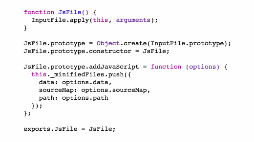
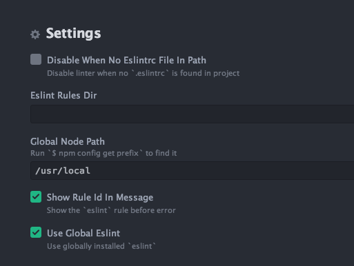
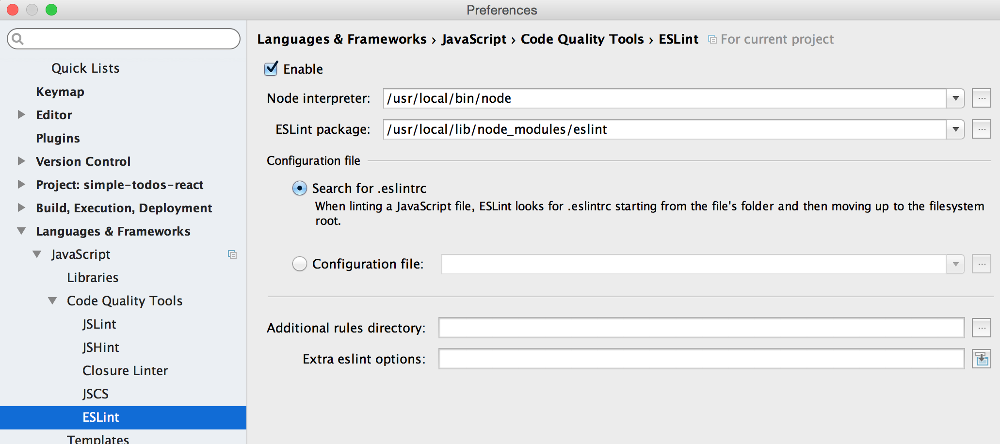

After reading this article, you'll know:

1. The benefits of having a style guide for your code, consistent across your organization and the Meteor community
2. Meteor's recommended JavaScript code style
3. How to set up JavaScript linting for your code
4. How to name all of the different parts of a Meteor app

<h2 id="benefits-style">Benefits of consistent style</h2>

Countless hours have been spent by developers throughout the years arguing over single vs. double quotes, where to put brackets, how many spaces to type, and all kinds of other cosmetic code style questions. These are all questions that have at best a tangential relationship to code quality, but are very easy to have opinions about because they are so visual.

While it's not necessarily important whether your code base uses single or double quotes for string literals, there are huge benefits to making that decision once and having it be consistent across your organization. These benefits also apply to the Meteor and JavaScript development communities as a whole.

<h3 id="easy-to-read">Easy to read code</h3>

The same way that you don't read English sentences one word at a time, you don't read code one token at a time. Mostly you just look at the shape of a certain expression, or the way it highlights in your editor, and assume what it does. If the style of every bit of code is consistent, that ensures that bits of code that look the same actually _are_ the same - there isn't any hidden punctuation or gotchas that you don't expect, so you can focus on understanding the logic instead of the symbols. One example of this is indentation - while in JavaScript, indentation is not meaningful, it's helpful to have all of your code consistently indented so that you don't need to read all of the brackets in detail to see what is going on.

```js
// This code is misleading because it looks like both statements
// are inside the conditional.
if (condition)
  firstStatement();
  secondStatement();
```

```js
// Much clearer!
if (condition) {
  firstStatement();
}

secondStatement();
```

<h3 id="automatic-error-checking">Automatic error checking</h3>

Having a consistent style means that it's easier to adopt standard tools for error checking. For example, if you adopt a convention that you must always use `let` or `const` instead of `var`, you can now use a tool to ensure all of your variables are scoped the way you expect. That means you can avoid bugs where variables act in unexpected ways. Also, by enforcing that all variables are declared before use, you can easily catch typos before even running any code!

<h3 id="deeper-understanding">Deeper understanding</h3>

It's hard to learn everything about a programming language at once. For example, programmers new to JavaScript often struggle with the `var` keyword and function scope. Using a community-recommended coding style with automatic linting can warn you about these pitfalls proactively. This means you can jump right into coding without learning about all of the edge cases of JavaScript ahead of time.

As you write more code and come up against the recommended style rules, you can take that as an opportunity to learn more about your programming language and how different people prefer to use it.

<h2 id="javascript">JavaScript style</h2>

Here at Meteor, we strongly believe that JavaScript is the best language to build web applications, for a variety of reasons. JavaScript is constantly improving, and the standards around ES2015 have really brought together the JavaScript community. Here are our recommendations about how to use ES2015 JavaScript in your app today.



<h3 id="ecmascript">Use the `ecmascript` package</h3>

ECMAScript, the language standard on which every browser's JavaScript implementation is based, has moved to yearly standards releases. The newest complete standard is ES2015, which includes some long-awaited and very significant improvements to the JavaScript language. Meteor's `ecmascript` package compiles this standard down to regular JavaScript that all browsers can understand using the [popular Babel compiler](https://babeljs.io/). It's fully backwards compatible to "regular" JavaScript, so you don't have to use any new features if you don't want to. We've put a lot of effort into making advanced browser features like source maps work great with this package, so that you can debug your code using your favorite developer tools without having to see any of the compiled output.

The `ecmascript` package is included in all new apps and packages by default, and compiles all files with the `.js` file extension automatically. See the [list of all ES2015 features supported by the ecmascript package](https://github.com/meteor/meteor/tree/master/packages/ecmascript#supported-es2015-features).

To get the full experience, you should also use the `es5-shim` package which is included in all new apps by default. This means you can rely on runtime features like `Array#forEach` without worrying about which browsers support them.

All of the code samples in this guide and future Meteor tutorials will use all of the new ES2015 features. You can also read more about ES2015 and how to get started with it on the Meteor Blog:

- [Getting started with ES2015 and Meteor](http://info.meteor.com/blog/es2015-get-started)
- [Set up Sublime Text for ES2015](http://info.meteor.com/blog/set-up-sublime-text-for-meteor-es6-es2015-and-jsx-syntax-and-linting)
- [How much does ES2015 cost?](http://info.meteor.com/blog/how-much-does-es2015-cost)

<h3 id="style-guide">Follow the Meteor JavaScript style guide</h3>

We have a JavaScript style guide which is heavily based on the popular AirBnB style guide, but has been content edited to include only essential rules. If you would like to follow this style guide in your non-Meteor applications, you will need to enable the same Babel features as supported by the `ecmascript` package linked above.

[Read the Meteor JavaScript style guide.](https://github.com/meteor/javascript)

<h2 id="eslint">Check your code with ESLint</h2>

"Code linting" is the process of automatically checking your code for common errors or style problems. For example, ESLint can determine if you have made a typo in a variable name, or some part of your code is unreachable because of a poorly written `if` condition.

We have a standard ESLint configuration that verifies as much as possible of the Meteor JavaScript style guide.

- [Get the Meteor ESLint configuration here.](XXX we need both eslintrc and eslintignore)

Below, you can find directions for setting up automatic linting at many different stages of development. In general, you want to run the linter as often as possible, because it's the fastest and easiest way to identify typos and small errors.

<h3 id="eslint-installing">Installing and running ESLint</h3>

To get ESLint up and running on your computer, install the command line tool with NPM:

```
npm install -g eslint
npm install -g babel-eslint
npm install -g eslint-plugin-react
```

Copy the standard Meteor `.eslintrc` and `.eslintignore` files from above into your app directory, and run the linter on your code with:

```
eslint .
```

For more details, read the [Getting Started](http://eslint.org/docs/user-guide/getting-started) directions from the ESLint website.

<h3 id="eslint-editor">Integrating ESLint with your editor</h3>

Linting is the fastest way to find potential bugs in your code. Running a linter is usually faster than running your app or your unit tests, so it's a good idea to run it all the time. Setting up linting in your editor can seem annoying at first since it will complain often when you save poorly-formatted code, but over time you'll develop the muscle memory to just write well-formatted code in the first place. Here are some directions for setting up ESLint in different editors:


<h4 id="eslint-sublime">Sublime Text</h4>

You can install the Sublime Text packages that integrate them into the text editor. It's generally recommended to use Package Control to add these packages. If you already have that setup, you can just add the these packages by name; if not, click the instructions links:

* Babel (for syntax highlighting – [full instructions](https://github.com/babel/babel-sublime#installation))
* SublimeLinter ([full instructions](http://sublimelinter.readthedocs.org/en/latest/installation.html))
* SublimeLinter-contrib-eslint ([full instructions](https://github.com/roadhump/SublimeLinter-eslint#plugin-installation))

To get proper syntax highlighting, go to a .js file, then select the following through the *View* dropdown menu: *Syntax* -> *Open all with current extension as...* -> *Babel* -> *JavaScript (Babel)*. If you are using React .jsx files, do the same from a .jsx file. If it's working, you will see "JavaScript (Babel)" in the lower right hand corner of the window when you are on one of these files. Refer to the [package readme](https://github.com/babel/babel-sublime) for information on compatible color schemes.

A side note for Emmet users: You can use *\<ctrl-e\>* to expand HTML tags in .jsx files, and it will correctly expand classes to React's "className" property. You can bind to the tab key for this, but [you may not want to](https://github.com/sergeche/emmet-sublime/issues/548).

<h4 id="eslint-sublime">Atom</h4>

Install the following three Atom packages. Here's how to install them from the terminal, but you can also select them from within Atom:

    apm install language-babel
    apm install linter
    apm install linter-eslint

Go to *Settings -> Packages.* Under "linter-eslint", click the *Settings* button. To allow atom to see ESLint, you need to set "Global Node Path" to your Node path. As indicated in Atom, you can find this out with the following command in the terminal:

    npm config get prefix

This will return something like `/usr/local`. Add this to the "Global Node Path", and check "Use Global Eslint":



Then **restart Atom** to activate linting.


<h4 id="eslint-sublime">WebStorm</h4>

WebStorm provides [these instructions for using ESLint](https://www.jetbrains.com/webstorm/help/eslint.html). After you install the ESLint Node packages and set up your `.eslintrc` file, just enable ESLint and click "Apply". You can configure how WebStorm should find your `.eslintrc` file, but on my machine it worked without any changes. It also automatically suggested switching to "JSX Harmony" syntax highlighting.



Linting can be activated on WebStorm on a project-by-project basis, or you can set ESLint as a default under Editor > Inspections, choosing the Default profile, checking "ESLint", and applying.


<h3 id="eslint-commit-hook">Setting up a commit hook for linting</h3>

XXX

<h3 id="eslint-ci">Running ESLint in your CI environment</h3>

XXX

<h2 id="meteor-features">Meteor features</h2>

The section above talked about JavaScript code in general - you can easily apply it in any JavaScript application, not just with Meteor apps. However, there are some style questions that are Meteor-specific, in particular how to name and structure all of the different components of your app.

<h3 id="collections">Collections</h3>

Collections should be named as a plural noun, in PascalCase. The name of the collection in the database (the first argument to the collection constructor) should be the same as the name of the JavaScript symbol.

```js
// Defining a collection
Lists = new Mongo.Collection('Lists');
```

Fields in the database should be camelCased just like your JavaScript variable names.

```js
// Inserting a document with camelCased field names
Widgets.insert({
  myFieldName: 'Hello, world!',
  otherFieldName: 'Goodbye.'
});
```

<h3 id="methods-and-publications">Methods and publications</h3>

Method and publication names should be camelCased and namespaced to a module or collection. For example, if you have a Method related to the Todos collection:

```js
// Naming a method
Todos.methods.updateText = new ValidatedMethod({
  name: 'Todos.methods.updateText',
  // ...
});
```

Note that this code sample uses the [ValidatedMethod package recommended in the Methods article](methods.html#XXX). If you aren't using that package, you can use the name as the property passed to `Meteor.methods`.

Here's how this naming convention looks when applied to a publication:

```js
// Naming a publication
Meteor.publish('Lists.public', function() {
  // ...
});
```

<h3 id="files-and-exports">Files, exports, and packages</h3>

You should use the ES2015 `import` and `export` features to manage your code. This will let you better understand the dependencies between different parts of your code, and it will be easy to know where to look if you need to read the source code of a dependency.

Each file in your app should represent one logical module. Avoid having catch-all utility modules that export a variety of unrelated functions and symbols. Often, this can mean that it's good to have one class, UI component, or collection per file, but there are cases where it is OK to make an exception, for example if you have a UI component with a small sub-component that isn't used outside of that file.

When a file represents a single class or UI component, the file should be named the same as the thing it defines, with the same capitalization. So if you have a file that exports a class:

```js
export class ClickCounter { ... }
```

This class should be defined inside a file called `ClickCounter.js`. When you import it, it'll look like this:

```js
import ClickCounter from './ClickCounter.js';
```

Note that imports use relative paths, and include the file extension at the end of the file name.

<h3 id="templates-and-components">Templates and components</h3>

Since Spacebars templates are always global, can't be imported and exported as modules, and need to have names that are completely unique across the whole app, we recommend naming your Blaze templates with the full path to the namespace, separated by underscores. Underscores are a great choice in this case because then you can easily type the name of the template as one symbol in JavaScript.

```html
<template name="Lists_show">
  ...
</template>
```

If this template is a "smart" component that loads server data and accesses the router, append `_page` to the name:

```html
<template name="Lists_show_page">
  ...
</template>
```

Often when you are dealing with templates or UI components, you'll have several closely coupled files to manage. They could be two or more of HTML, CSS, and JavaScript. In this case, we recommend putting the files together in the same directory with the same name:

```
# The Lists_show template from the Todos example app has 3 files:
show.html
show.js
show.less
```

The whole directory or path should indicate that these templates are related to the `Lists` module, so it's not necessary to reproduce that information in the file name. Read more about directory structure in the [Application Structure article](XXX).

If you are writing your UI in React, you don't need to use the underscore-split names because you can import and export your components using the JavaScript module system.
